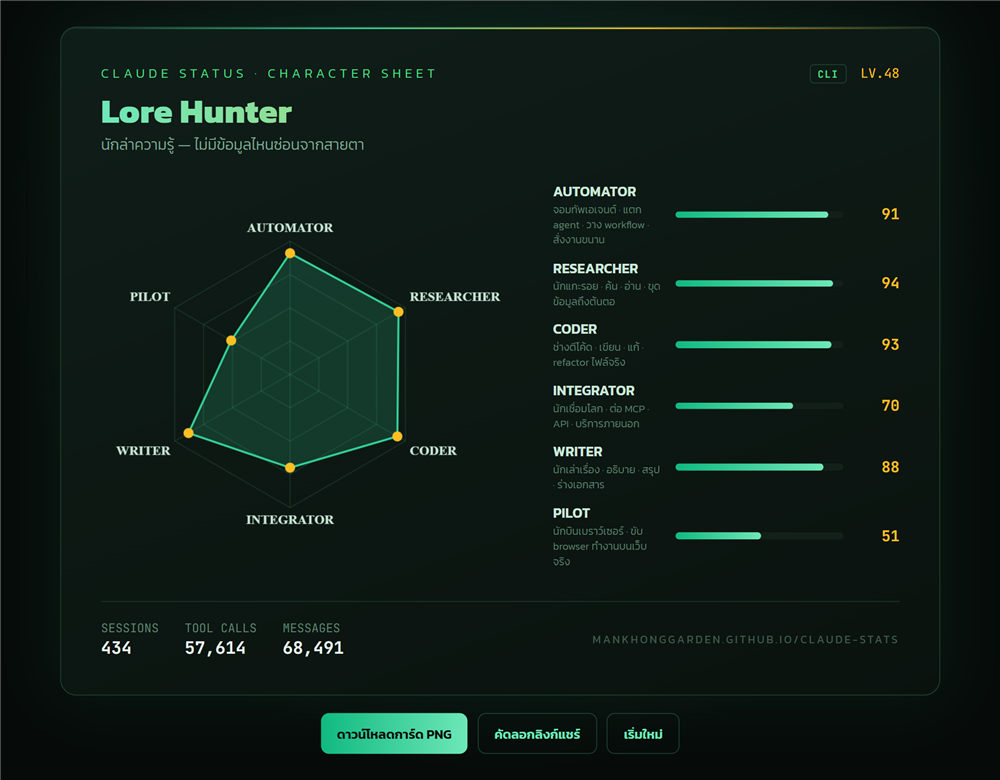

# claude-stats

[](LICENSE)

**Claude Status Check** — analyze your Claude usage and get an MMORPG-style character sheet: a radar chart of 6 stats, a character class, and a level.



A hobby project. No server, no accounts, no tracking. Everything runs on your machine or in your browser.

<!--
Suggested GitHub topics:
claude, claude-code, anthropic, cli, github-pages, radar-chart, character-sheet, usage-stats, mmorpg, fun
-->

## Quick start

### Path 1 — Claude Code users (CLI)

```bash
npx github:MankhongGarden/claude-stats
# or, once published to npm:
npx claude-character-sheet
# pin to an immutable release for reproducibility:
npx github:MankhongGarden/claude-stats#v1.0.0
```

Scans your local Claude Code transcripts (`~/.claude/projects` or `$CLAUDE_CONFIG_DIR/projects`), prints a terminal stat card, and gives you a share URL that opens the web card.

Flags:

| flag | effect |
|---|---|
| `--json` | raw JSON output, no card |
| `--no-share` | skip the share URL |
| `--dir <path>` | use a custom transcripts directory |
| `--help` | usage |

### Path 2 — claude.ai users (web upload · **beta**)

Open the web page and drop your claude.ai data export (`conversations.json`) onto it:

**https://mankhonggarden.github.io/claude-stats/**

How to get the file: claude.ai → Settings → Privacy → Export data → the file arrives by email.

> **Beta note:** the claude.ai export parser is written against the publicly documented export shape but has not been validated against every real export. If your file is not recognized, please [open an issue](../../issues) — ideally describing the top-level structure (no need to share any conversation content).

## Privacy model

- **CLI:** transcripts are read locally and never leave your machine. Only the 6 aggregate scores plus three totals (sessions, tool calls, message count) are encoded into the share URL hash — the level shown on the card is derived from those totals. Nothing else travels.
- **Web upload:** `conversations.json` is parsed entirely in your browser (client-side JavaScript). There is no backend and no upload endpoint — there is nowhere for the file to go.
- **Share URL:** contains only the aggregated numbers (6 scores + 3 totals), base64url-encoded in the `#s=` hash. Anyone with the link sees your stat card, never your conversations.
- The web app vendors its JS libraries locally — opening the page makes no third-party API calls except Google Fonts (CSS only).

## How scoring works

Each tool call (CLI) or message heuristic (web) is classified into one of 6 axes:

| axis | what it measures | example signals (CLI) |
|---|---|---|
| AUTOMATOR | agents, workflows, shell automation | Agent, Task, Workflow, Bash, PowerShell |
| RESEARCHER | searching and reading | WebSearch, WebFetch, Read, Grep, Glob |
| CODER | writing and editing real files | Edit, Write, NotebookEdit |
| INTEGRATOR | external services via MCP | any other `mcp__*` tool |
| WRITER | prose output volume | assistant text chars / 4000 |
| PILOT | driving a real browser | chrome-devtools / playwright MCP tools |

Score per axis: `min(100, round(100 * sqrt(x / REF)))` — a square-root curve, so early activity climbs fast and the top end is hard to max.

REF anchors (what 100 means), v1:

| axis | REF (CLI units) | REF (web units) |
|---|---|---|
| automator | 25000 | 1200 |
| researcher | 15000 | 1500 |
| coder | 15000 | 800 |
| integrator | 8000 | 400 |
| writer | 4000 | 2500 |
| pilot | 4000 | 100 |

**Honest calibration note:** the v1 anchors are derived from a single heavy daily user's corpus (~426 sessions / ~57k tool calls over ~6 weeks, snapshot 2026-06-12). They represent "heavy daily user" as one data point, not a population study. Expect recalibration in later versions.

Level: `floor(sqrt(effort / 25))`, where effort = total tool calls (CLI) or total messages × 4 (web). Minimum level 1.

## Character classes

Your top axis decides your class (ties break by axis order):

| top axis | class |
|---|---|
| automator | **Fleet Commander** — ผู้บัญชาการกองทัพ AI |
| researcher | **Lore Hunter** — นักล่าความรู้ |
| coder | **Code Smith** — ช่างหลอมโค้ด |
| integrator | **Realm Linker** — ผู้เชื่อมทุกอาณาจักร API |
| writer | **Chronicle Keeper** — ผู้จดบันทึกแห่งยุค |
| pilot | **Web Navigator** — นักบินผู้พิชิตทุกหน้าเว็บ |

## FAQ

**Why is my level low?**
Levels follow a square-root curve against total volume — they're meant to climb slowly. The anchors are calibrated against a very heavy user, so a "normal" usage pattern landing at level 5–15 is expected, not a bug.

**Does this upload my chats anywhere?**
No. There is no server. CLI parsing happens on your machine; web parsing happens in your browser. The only thing that ever travels is the share URL you choose to copy, which contains 6 scores + 3 totals (sessions, tool calls, message count) — never message text.

**The web upload says my file format isn't recognized.**
The claude.ai parser is beta. Export formats can change. Please open an issue with a description of the file's top-level structure.

**Can I compare with friends?**
CLI cards compare to CLI cards — scores use fixed anchors (not self-relative), so two Claude Code users' cards are directly comparable. The web (claude.ai) card is a **rough text-inferred estimate** and is **not** comparable to a CLI card; the `CLI` / `WEB · BETA` badge next to the level tells you which kind you're looking at.

---

## สรุปภาษาไทย

**Claude Status Check** — เช็คสถานะการใช้ Claude ของคุณ แล้วได้การ์ดตัวละครสไตล์เกม MMORPG: กราฟเรดาร์ 6 ค่าพลัง + คลาส + เลเวล

**2 ทางเข้า:**

- **สาย Claude Code:** รัน `npx github:MankhongGarden/claude-stats` ใน terminal — สแกน transcript ในเครื่อง พิมพ์การ์ดสรุป + ลิงก์แชร์
- **สาย claude.ai (เบต้า):** ไปที่ https://mankhonggarden.github.io/claude-stats/ แล้วลากไฟล์ `conversations.json` (ขอ export ได้ที่ Settings → Privacy → Export data ไฟล์มาทางอีเมล) — ตัวอ่านไฟล์ยังเป็นเวอร์ชันเบต้า ถ้าไฟล์อ่านไม่ได้ช่วยเปิด issue บอกหน่อย

**ความเป็นส่วนตัว:** ข้อมูลบทสนทนาไม่ออกจากเครื่องเลย — CLI อ่านไฟล์ในเครื่อง ส่วนหน้าเว็บอ่านไฟล์ในเบราว์เซอร์เท่านั้น ไม่มี server ไม่มีการอัปโหลด สิ่งเดียวที่อยู่ในลิงก์แชร์คือเลขคะแนนรวม 6 ค่า

**คะแนน:** คิดจากปริมาณการใช้งานจริงเทียบกับค่าอ้างอิงคงที่ (สูตร square root) เทียบข้ามคนได้ · ค่าอ้างอิง v1 มาจากข้อมูลผู้ใช้หนัก 1 คน อาจปรับใหม่ในเวอร์ชันถัดไป

โปรเจกต์งานอดิเรก ฟรี โอเพนซอร์ส (MIT)
